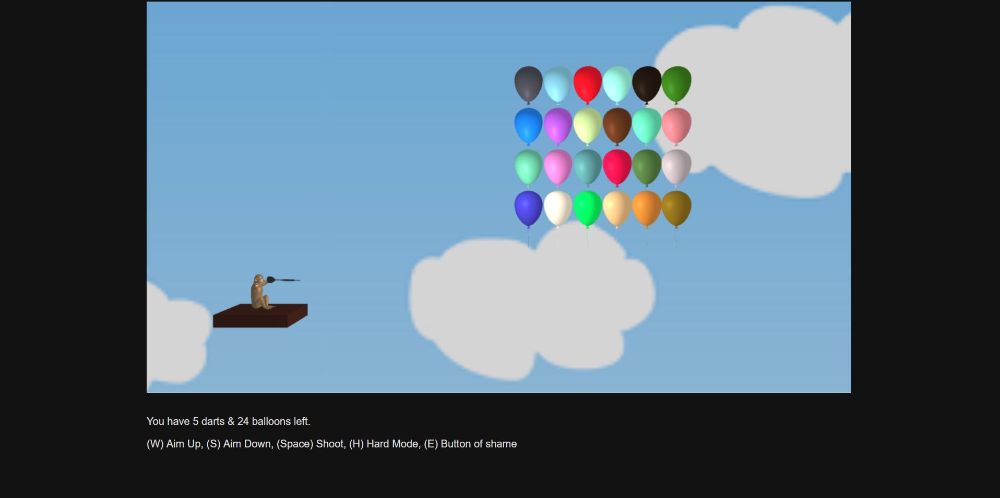

# Bloons

Our homage to the 2007 Flash game Bloons.

## Setup

### Requirements

Python 3

### Run

```
python server.py
```

Open at localhost:8000

## Screenshots
 | 

## Demo Slides
https://docs.google.com/presentation/d/1o1rvjSWi1MRmZt4RjmWhOH02mNUj8UDKdSb9lgkrh-g/edit?usp=sharing

## About

This is our final project for CS 174A Spring 2022 at UCLA. Using tiny-graphics, we implemented
a simple balloon popping game inspired by Bloons (please don't sue us). In addition to the basic
game, we have 2 advanced features:

* Physics based motion (dart)
* Collision detection (popping balloons)

Some notable challenges included refining the dart's parabolic motion, adjusting the angle of the camera
for hard mode, and implementing logic for a game (resetting, hard mode, win/lose conditions, etc.)</br>

By Group 19 - Michael Choi, Roye Fang, Sharon Tam
